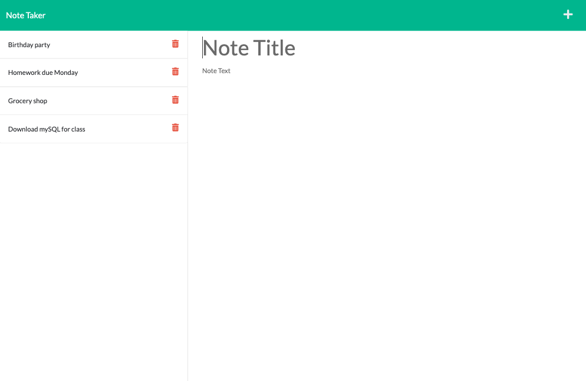
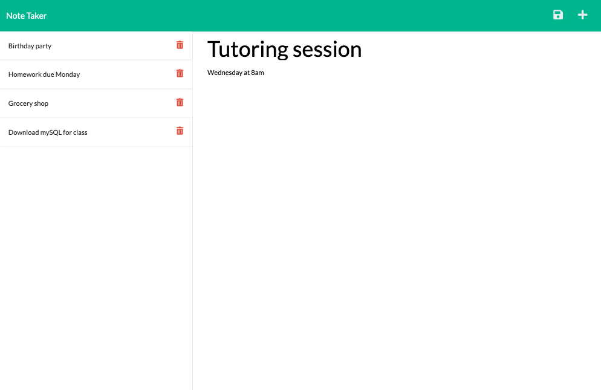

# Notes Express

## Description

Notes Express is a note taking application that allows the user to write, save, and delete notes. This is accomplished using Express.js on the back end of the application. 

## Table of Contents

- [Installation](#installation)
- [Usage](#usage)
- [License](#license)
- [Contributing](#contributing)
- [Tests](#tests)
- [Questions](#questions)

## Installation 

This application uses Express.js, Node.js, and fs. Please use `npm i` to install the required packages for this application.

## Usage 

Notes Express is a useful note-taking tool for anyone looking to keep track of tasks in order to stay organized.

Upon loading the webpage, the user is presented with a landing page for the note taker with a button to get started.

Clicking the button takes the user to a new page. This is where the adding, saving, and deleting of notes occurs.

* Previously saved notes appear on the left side and a place to enter a new note is on the right side.

* Once a note title and note text have been entered, a save button appears, allowing the user to save the note and add it to the list of notes.

Accessing, adding, and deleting notes:

* Clicking on previously saved notes will open up that note on the right-hand side.

* Additional notes can be added by clicking the 'plus sign' button in the top right corner of the page.

* To delete a saved note, simply click on the trash icon button next to the note to remove it from the list.

[Deployed Application](https://notes-express-production.up.railway.app/notes)

## License 

Notes Express is available under the MIT license.

Please see [LICENSE](./LICENSE) for the full details of the license.

## Contributing 

The contributors of this application have adopted the Contributor Covenant Code of Conduct. Please visit the [Code of Conduct](./CODE_OF_CONDUCT) page for details.

## Tests 

This application doesn't have any tests at this time.

## Questions 

Please reach out via the the link below with any additional questions. 

[GitHub](https://github.com/smdann)
